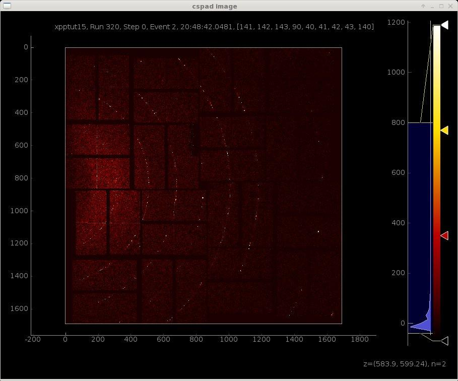
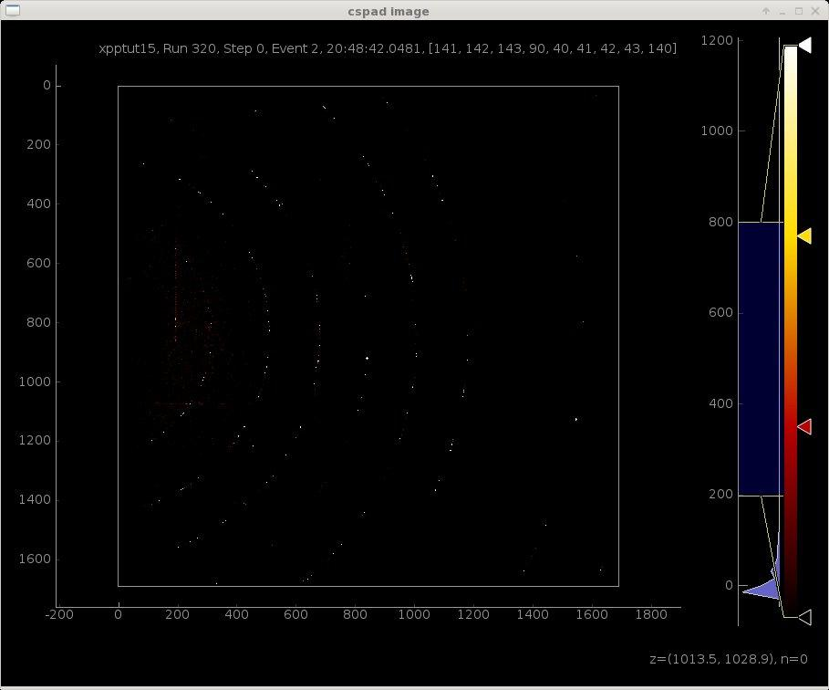
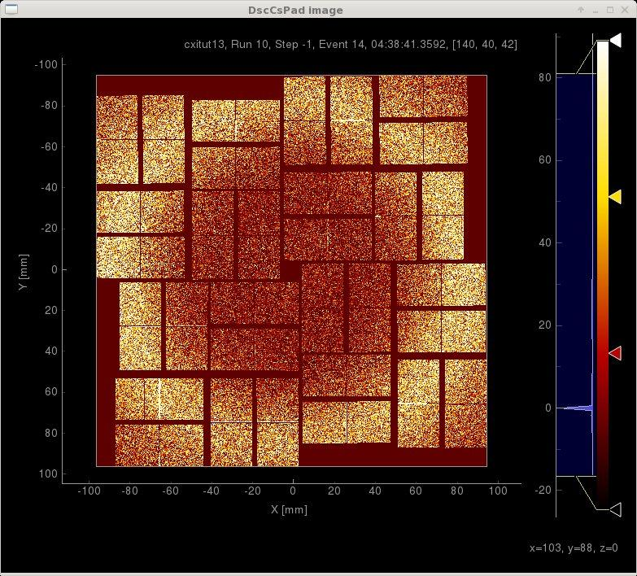
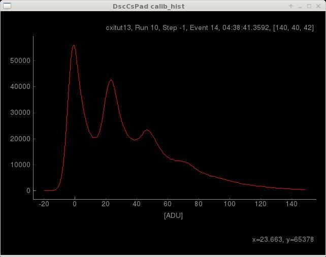
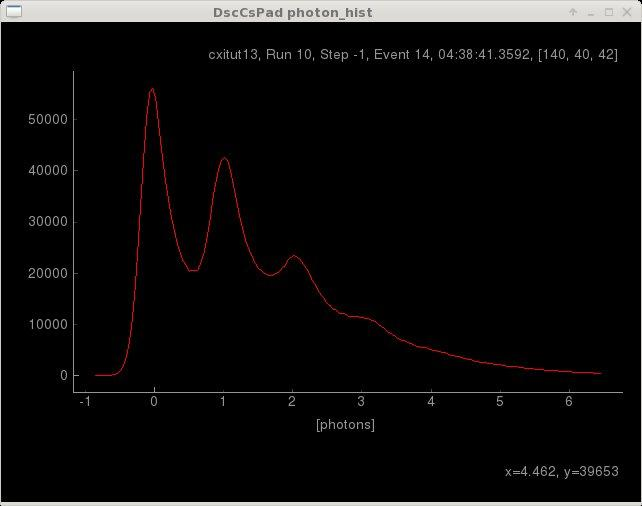
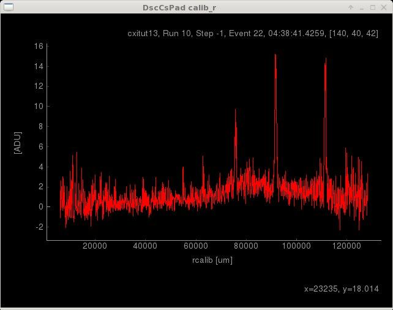
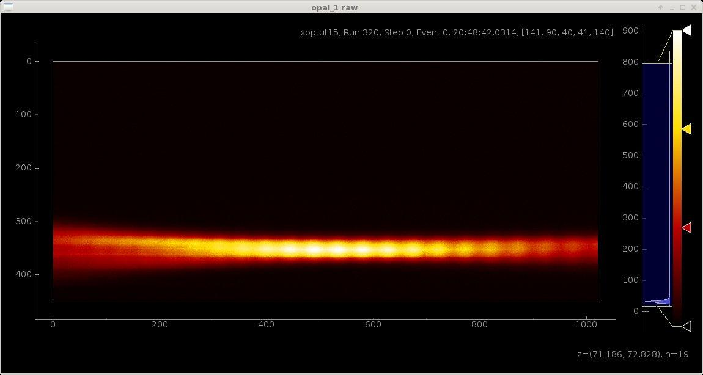
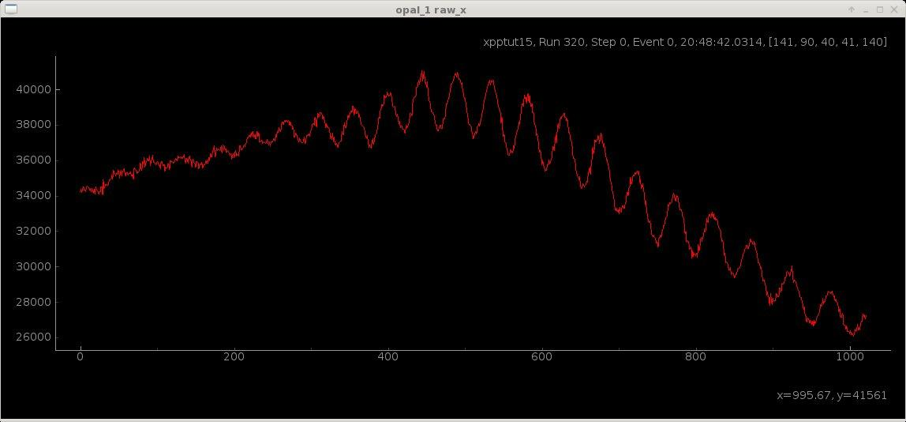

.. _data_processing:

.. currentmodule:: PyDataSource

Data Processing
***************

With the 'add' property for each detector, a collection of methods are provided to add parameters, properties, and reduction/proccesing of data with roi, projection, histogram methods. 

We will use some practice data summarized in a table found at this link:
https://confluence.slac.stanford.edu/display/PSDM/Publicly+Available+Practice+Data

Tutorial Data
-------------

We start by loading XPP cspad data that shows powder rings from LaB6 sample

.. sourcecode:: ipython

    In [1]: import PyDataSource

    In [2]: ds  = PyDataSource.DataSource(exp='xpptut15',run=320)

    In [3]: ds.configData
    Out[3]: < ConfigData: exp=xpptut15:run=320:smd >
    *Detectors in group 0 are "BLD" data recorded at 120 Hz on event code 40
    *Detectors listed as Controls are controls devices with unknown event code (but likely 40).

    Alias                     Group          Rate  Code  Pol. Delay [s]    Width [s]    Source                    
    ------------------------------------------------------------------------------------------------------------------------
    EBeam                         0        120 Hz    40                                 BldInfo(EBeam)                          
    FEEGasDetEnergy               0        120 Hz    40                                 BldInfo(FEEGasDetEnergy)                
    PhaseCavity                   0        120 Hz    40                                 BldInfo(PhaseCavity)                    
    XPP_AIN_01                    0        120 Hz    40                                 BldInfo(XPP-AIN-01)                     
    XppEnds_Ipm0                  0        120 Hz    40                                 BldInfo(XppEnds_Ipm0)                   
    XppMon_Pim0                   0        120 Hz    40                                 BldInfo(XppMon_Pim0)                    
    XppMon_Pim1                   0        120 Hz    40                                 BldInfo(XppMon_Pim1)                    
    XppSb2_Ipm                    0        120 Hz    40                                 BldInfo(XppSb2_Ipm)                     
    XppSb3_Ipm                    0        120 Hz    40                                 BldInfo(XppSb3_Ipm)                     
    cspad                         1 Beam & 120 Hz   140   Pos 0.000559109  0.000010000  DetInfo(XppGon.0:Cspad.0)               
    opal_1                        1 Beam & 120 Hz   140   Pos 0.000800000  0.000300000  DetInfo(XppEndstation.0:Opal1000.1)     
    usbencoder                    1 Beam & 120 Hz   140   Pos 0.000559109  0.000010000  DetInfo(XppEndstation.0:USDUSB.0)       
    < ConfigData: exp=xpptut15:run=320:smd >

    In [4]: evt = ds.events.next()

Data visualization
------------------

The cspad image can be visualized using the add.psplot method. 

.. sourcecode:: ipython

    In [5]: evt.cspad.add.psplot('image')
      psmon plot added -- use the following to view: 
      --> psplot -s psanaphi108 -p 12301 cspad_image
      WARNING -- see notice when adding for -p PORT specification
                 if default PORT=12301 not available

In the image that pops up in a separate window, one can see both rings and background after adjusting the scale bar on the right.

To view this plot on another machine, first set the environment and then copy the line in the ipython output from above.

.. code-block:: bash

    .  /reg/g/psdm/etc/ana_env.sh
    source conda_setup
    psplot -s psanaphi108 -p 12301 cspad_image

Adjusting the lower threshold to 200 eliminates most of the background leaving the rings.

These plots will be automatically updated for each next event.  This real-time monitoring is generated using the psana psmon package (based on PyQtGraph).  These plots can be viewed on multiple other machines as well as locally (using the zmq protocal).

For another plotting example, open cxi lysozyme crystallography tutorial data.  Plot the image for the DscCsPad (i.e., the front CSpad detector for the CXI 1 um focus SC1 chamber).  Jump to event 14, which has extra background so that there are multiple photons in many of the detector pixels.

.. sourcecode:: ipython
    
    In [6]: ds = PyDataSource.DataSource(exp='cxitut13',run=10)

    In [7]: ds.configData
    Out[7]: < ConfigData: exp=cxitut13:run=10:smd >
    *Detectors in group 0 are "BLD" data recorded at 120 Hz on event code 40
    *Detectors listed as Controls are controls devices with unknown event code (but likely 40).

    Alias                     Group          Rate  Code  Pol. Delay [s]    Width [s]    Source                    
    ------------------------------------------------------------------------------------------------------------------------
    DscCsPad                      1        120 Hz    40   Neg 0.000790723  0.000040000  DetInfo(CxiDs1.0:Cspad.0)               
    EBeam                         0        120 Hz    40                                 BldInfo(EBeam)                          
    FEEGasDetEnergy               0        120 Hz    40                                 BldInfo(FEEGasDetEnergy)                
    PhaseCavity                   0        120 Hz    40                                 BldInfo(PhaseCavity)                    
    < ConfigData: exp=cxitut13:run=10:smd >

    In [8]: evt = ds.events.next()

    In [9]: evt.DscCsPad.add.psplot('image')
    psmon plot added -- use the following to view: 
    --> psplot -s psanaphi103 -p 12301 DscCsPad_image
    WARNING -- see notice when adding for -p PORT specification
               if default PORT=12301 not available

    In [10]: evt.next(14)
    Out[10]: < EvtDetectors: cxitut13, Run 10, Step -1, Event 14, 04:38:41.3592, [140, 40, 42] >

Make a Histogram 
----------------

Use the add.histogram method to make a histogram to determain the detector gain.

.. sourcecode:: ipython

    In [11]: evt.DscCsPad.add.histogram('calib', bins=np.arange(-20,150,1), publish=True)
    psmon plot added -- use the following to view: 
    --> psplot -s psanaphi103 -p 12301 DscCsPad_calib_hist
    WARNING -- see notice when adding for -p PORT specification
               if default PORT=12301 not available

Setting Parameters
------------------

To set a parameters in the detector object for use later, use the add.parameter method.  These parameters can be output in a config file along with all the other actions described in this section, and they will persists for example if the DataSource is reloaded or a module is added or updated. 

Moving the cursor to the top of the second peak from the left in the histogram, we find the 1-photon peak is at an x position of ~23 ADU.  Use the add.parameter method to set the gain attribute and use it in making a new photon counts histogram.

.. sourcecode:: ipython

    In [12]: evt.DscCsPad.add.parameter(gain=1/23.)

    In [13]: bins = np.arange(-20,150,1)*evt.DscCsPad.gain

    In [14]: evt.DscCsPad.add.histogram('calib', bins=bins, gain=evt.DscCsPad.gain, name='photon_hist', unit='photons', doc='Gain corrected histogram', publish=Tr
        ...: ue)
    psmon plot added -- use the following to view: 
    --> psplot -s psanaphi103 -p 12301 DscCsPad_photon_hist
    WARNING -- see notice when adding for -p PORT specification
               if default PORT=12301 not available

Count Photons
-------------
Using limist of 12 to 10,000 ADU, and the gain factor of 23 ADU/photon we previously found, we can count the number of X-rays.  First jump to event 22 where there is less background.  Then use the add.count method to count the photons within the limits=(12,10000).  Use the show_info method to print a table of the current event information including results from the histogram and count methods.  

.. sourcecode:: ipython
    
    In [15]: evt.DscCsPad.add.count('calib', limits=(12,10000), gain=evt.DscCsPad.gain, unit='photons', doc='Photon Count')

    In [16]: evt.next(22)
    Out[16]: < EvtDetectors: cxitut13, Run 10, Step -1, Event 22, 04:38:41.4259, [140, 40, 42] >
     
    In [17]: evt.DscCsPad.show_info()
    Out[17]: 
    --------------------------------------------------------------------------------
    DscCsPad cxitut13, Run 10, Step -1, Event 22, 04:38:41.4259, [140, 40, 42]
    --------------------------------------------------------------------------------
    calib                   <1.137> ADU     Calibrated data
    image                  <0.8629> ADU     Reconstruced 2D image from calibStore geometry
    raw                  <1.17e+03> ADU     Raw data
    shape              (32, 185, 388)         Shape of raw data array
    size                    2296960         Total size of raw data
    --------------------------------------------------------------------------------
    User Defined Histograms:
    ------------------
    photon_hist         <1.359e+04> photons Gain corrected histogram
    calib_hist          <1.359e+04> ADU     Histogram of calib
    --------------------------------------------------------------------------------
    Detector Counts:
    ------------------
    calib_count          1.0453e+05 photons Photon Count
    --------------------------------------------------------------------------------
    User Defined Parameters:
    ------------------
    gain                   0.043478         

Make Projections
----------------

Use the add.projection method to make a radial projection of the CSpad data.  Note that it is more accurate as well as faster to compute the radial projection from the calib "unassembled data" rather than the assembled image.  The publish keyword opens a plot, in which we clearly see several diffraction rings.

.. sourcecode:: ipython

    In [19]: evt.DscCsPad.add.projection('calib', axis='r', publish=True)
    psmon plot added -- use the following to view: 
    --> psplot -s psanaphi103 -p 12301 DscCsPad_calib_r
    WARNING -- see notice when adding for -p PORT specification
               if default PORT=12301 not available

For another example we go back to the xpptut15 and open up a plot of the 'opal_1' camera.  Note that here we use 'raw' for the camera data since most cameras are already internally calibrated and do not need pedestal or common mode corrections and are already uniform 2D images, so do not need geometry files to create images. 

.. sourcecode:: ipython
    
    In [20]: evt.opal_1.add.psplot('raw')
    psmon plot added -- use the following to view: 
    --> psplot -s psanaphi108 -p 12301 opal_1_raw
    WARNING -- see notice when adding for -p PORT specification
               if default PORT=12301 not available

Now make a horizontal projection of the spectrum across the full horizontal range between 300-400 vertically.  i.e., roi = ((0,300),(1024,400))

.. sourcecode:: ipython
    
    In [21]: ds  = PyDataSource.DataSource(exp='xpptut15',run=320)
    In [22]: evt.opal_1.add.projection('raw', axis='x', roi=((0,300),(1024,400)), publish=True)
    psmon plot added -- use the following to view: 
    --> psplot -s psanaphi108 -p 12301 opal_1_raw_x
    WARNING -- see notice when adding for -p PORT specification
               if default PORT=12301 not available

Custom Module
-------------

For more advanced processing, an instance of the PyDataSource.Detector class can be created allowing 
for flexibility in writing advanced methods.  

.. sourcecode:: python

    import PyDataSource

    class Example(PyDataSource.Detector):
        """Example module.
        """

        def __init__(self,*args,**kwargs):

            PyDataSource.Detector.__init__(self,*args,**kwargs)

A module can then be added to a detector with the add.module method, as in the example below for a
module to process an 'Imp' waveform detector.  This module creates filtered waveform numpy arrays 
from the waveforms and calculates the peak amplitudes of the filtered waveforms.   

.. ipython:: python 

    import PyDataSource
    ds = PyDataSource.DataSource(exp='cxitut13',run=30)
    ds.configData
    evt = ds.events.next()
    evt.Sc2Imp.show_info()
    evt.Sc2Imp.add.module('impbox')
    evt.Sc2Imp.show_info()

The first plot below is the raw input waveforms for the four channels, and the second plot shows the filtered waveforms.
The amplitudes of the filtered waveforms are given in the table above from the show_info method.

.. plot:: examples/cxitut13_run30.py
   :include-source:

You could copy this module from the PyDataSource package to your work area, modify as desired and reload with the 
path keyword pointing to your work area. e.g., 

.. sourcecode:: python

    evt.Sc2Imp.add.module('impbox', path='~username/work/')

AddOn Class API
---------------

.. autosummary::
    :toctree: generated/

    AddOn

Attributes
----------

.. autosummary::
    :toctree: generated/

    AddOn.count
    AddOn.histogram
    AddOn.module
    AddOn.parameter
    AddOn.peak
    AddOn.projection
    AddOn.property
    AddOn.psplot

..
    The PyDataSource.AddOn API
    ^^^^^^^^^^^^^^^^^^^^^^^^^^^^^^^
    .. autoclass:: PyDataSource.AddOn
       :members:

