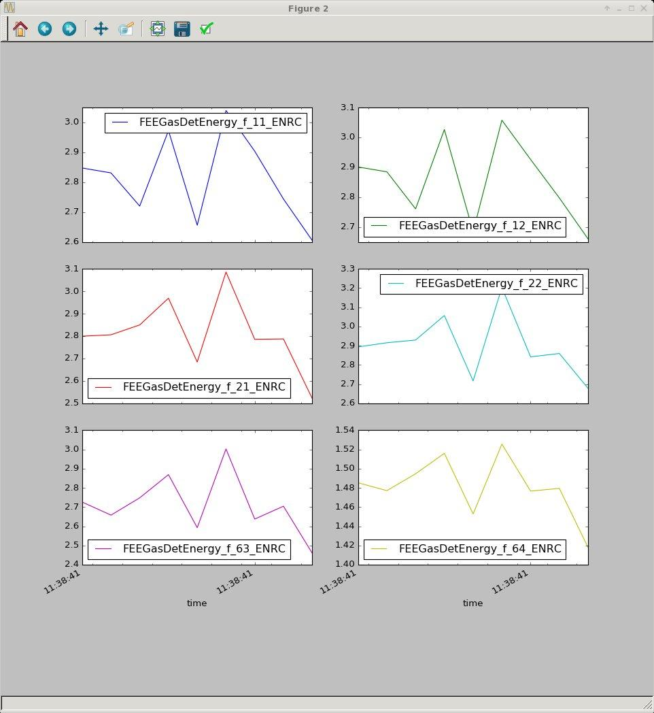

.. _data_structures:

.. currentmodule:: PyDataSource

Data Structures
***************

While accessing data on the event level is typically necessary at some level, it is often more desirable to deal with time series data or statistical summaries of groups of events (e.g., statistical mean for each 'step' in a scan).  To this end, we convert the native xtc binary LCLS data to hdf5 data structured to be compatible with the xarray package.

xarray_ "is an open source project and Python package that aims to bring the labeled data power of pandas_ to the physical sciences, by providing N-dimensional variants of the core pandas data structures."  At its most basic level, xarray simply makes numpy ndarrays convenient to use by adding dimension names and coordinate indexes.  It does so by extending the power of pandas_ to the multi-dimensional nature of scientific data like we have at LCLS event data consisting of:

 - scalar data (e.g., Photon Energy, Pulse Energy, position)
 - vector data (e.g., waveforms, spectra)
 - 2D arrays (e.g., camera images)
 - multi-dim arrays (e.g., cspad detector data)

These data sometimes share the same dimensions and all have the common additional dimension of time.  xarray_ provides a powerful structure for working with this sort of data, including associated meta data (like units and descriptions of data as well as overall information about the data set).      

In this section we show how to reduce our xtc run data into an appropriate xarray Dataset, and then show some examples of how to operate on the data to make plots and tables.  Once getting started with these examples, you can start taking advantage of the excellent documentation for xarray_ and pandas_ as well as plotting packages like seaborn_, which has support for pandas.  

.. _pandas: http://pandas.pydata.org
.. _xarray: http://xarray.pydata.org
.. _seaborn: http://seaborn.pydata.org/
.. _'why xarray': http://xarray.pydata.org/en/stable/why-xarray.html

Generating Run Data Sets
------------------------

We start with the basic data processing previously outlined for the cxi lysozyme crystallography data. 

.. sourcecode:: ipython

    In [1]: %pylab
    
    In [2]: import PyDataSource
    
    In [3]: ds = PyDataSource.DataSource(exp='cxitut13',run=10)
        
    In [4]: evt = ds.events.next()
    
    In [5]: evt.DscCsPad.add.parameter(gain=1/23.)
    
    In [6]: bins = np.arange(-20,150,1)*evt.DscCsPad.gain
    
    In [7]: evt.DscCsPad.add.histogram('calib', bins=bins, gain=evt.DscCsPad.gain, name='photon_hist', unit='photons', doc='Gain corrected histogram')
    
    In [8]: evt.DscCsPad.add.count('calib', limits=(12,10000), gain=evt.DscCsPad.gain, name='photon_count', unit='photons', doc='Photon Count')
    
    In [9]: evt.DscCsPad.add.projection('calib', axis='r')
    

Now load the first 10 events into an xarray Dataset.  The max_size keyword sets the maximum array size to be saved.  By default max_size=10001, which is about the size of data in the 'smd' Daq small data files that is most quickly retrieved from file.  By setting this to a large number (1e9), even large CSpad images are loaded.  Note that for tutorial data set auto_pvs=False and either save=False or set path keyword to a folder in your home directory since you will not necessarily have write permission to the tutorial experiment folders. 

.. sourcecode:: ipython
    
    In [10]: x = ds.to_hdf5(nevents=10, max_size=1e9, auto_pvs=False, save=False)
    updating DetInfo(CxiDs1.0:Cspad.0) DscCsPad
    updating BldInfo(FEEGasDetEnergy) FEEGasDetEnergy
    updating BldInfo(PhaseCavity) PhaseCavity
    updating BldInfo(EBeam) EBeam
    Begin processing 10 events
    DscCsPad image_yaxis (['sensor', 'row', 'column'], array([-94958.59118017, -94848.67118017, -94738.75118017, ...,
            95862.52881983,  95972.44881983,  96082.36881983]))
    xarray Dataset configured
    merging DscCsPad
    merging EBeam
    merging FEEGasDetEnergy
    merging PhaseCavity

    In [11]: x
    Out[11]: 
    <xarray.Dataset>
    Dimensions:                     (DscCsPad_X: 1741, DscCsPad_Y: 1739, DscCsPad_column: 388, DscCsPad_photon_hist_xaxis: 169, DscCsPad_rcalib: 1112, DscCsPad_row: 185, DscCsPad_sensor: 32, time: 9)
    Coordinates:
        DscCsPad_areas              (DscCsPad_sensor, DscCsPad_row, DscCsPad_column) float64 1.0 ...
        DscCsPad_coords_x           (DscCsPad_sensor, DscCsPad_row, DscCsPad_column) float64 -4.863e+04 ...
        DscCsPad_coords_y           (DscCsPad_sensor, DscCsPad_row, DscCsPad_column) float64 -3.122e+03 ...
        DscCsPad_coords_z           (DscCsPad_sensor, DscCsPad_row, DscCsPad_column) float64 1.579e+05 ...
        DscCsPad_gain               (DscCsPad_sensor, DscCsPad_row, DscCsPad_column) float32 1.0 ...
        DscCsPad_indexes_x          (DscCsPad_sensor, DscCsPad_row, DscCsPad_column) uint64 435 ...
        DscCsPad_indexes_y          (DscCsPad_sensor, DscCsPad_row, DscCsPad_column) uint64 835 ...
        DscCsPad_pedestals          (DscCsPad_sensor, DscCsPad_row, DscCsPad_column) float32 1021.99 ...
        XrayOff                     (time) bool False False False False False ...
        XrayOn                      (time) bool True True True True True True ...
        ec40                        (time) bool True True True True True True ...
        ec42                        (time) bool False False True False False ...
        fiducials                   (time) int32 24258 24261 24264 24267 24270 ...
        nsec                        (time) int32 242496559 250830589 259164948 ...
        run                         (time) int32 10 10 10 10 10 10 10 10 10
        sec                         (time) int32 1463398721 1463398721 ...
        step                        (time) int64 0 0 0 0 0 0 0 0 0
        ticks                       (time) int32 331316 331106 330630 329804 ...
      * DscCsPad_row                (DscCsPad_row) int64 0 1 2 3 4 5 6 7 8 9 10 ...
      * DscCsPad_rcalib             (DscCsPad_rcalib) float64 6.196e+03 ...
      * DscCsPad_photon_hist_xaxis  (DscCsPad_photon_hist_xaxis) float64 -0.8478 ...
      * DscCsPad_X                  (DscCsPad_X) float64 -9.639e+04 -9.628e+04 ...
      * DscCsPad_Y                  (DscCsPad_Y) float64 -9.496e+04 -9.485e+04 ...
      * time                        (time) datetime64[ns] 2016-05-16T11:38:41.242496512 ...
      * DscCsPad_column             (DscCsPad_column) int64 0 1 2 3 4 5 6 7 8 9 ...
      * DscCsPad_sensor             (DscCsPad_sensor) int64 0 1 2 3 4 5 6 7 8 9 ...
    Data variables:
        DscCsPad_calib              (time, DscCsPad_sensor, DscCsPad_row, DscCsPad_column) float64 6.375 ...
        DscCsPad_calib_r            (time, DscCsPad_rcalib) float64 3.682 0.7893 ...
        DscCsPad_image              (time, DscCsPad_X, DscCsPad_Y) float64 0.0 ...
        DscCsPad_photon_count       (time) float64 1.573e+05 5.603e+05 3.773e+05 ...
        DscCsPad_photon_hist        (time, DscCsPad_photon_hist_xaxis) float64 0.0 ...
        EBeam_damageMask            (time) float64 0.0 0.0 0.0 1.536e+04 ...
        EBeam_ebeamCharge           (time) float64 0.248 0.2482 0.2496 0.2515 ...
        EBeam_ebeamDumpCharge       (time) float64 1.132e+09 1.126e+09 1.136e+09 ...
        EBeam_ebeamEnergyBC1        (time) float64 -0.0622 -0.07417 -0.08815 ...
        EBeam_ebeamEnergyBC2        (time) float64 0.1851 0.1546 0.2375 -0.06483 ...
        EBeam_ebeamL3Energy         (time) float64 1.346e+04 1.346e+04 1.347e+04 ...
        EBeam_ebeamLTU250           (time) float64 -0.01082 0.001563 0.01469 ...
        EBeam_ebeamLTU450           (time) float64 0.09316 0.08028 0.06868 ...
        EBeam_ebeamLTUAngX          (time) float64 0.1495 0.1621 0.1507 0.1596 ...
        EBeam_ebeamLTUAngY          (time) float64 -0.02271 -0.02662 -0.02377 ...
        EBeam_ebeamLTUPosX          (time) float64 0.03425 0.03952 0.01846 ...
        EBeam_ebeamLTUPosY          (time) float64 0.001111 -0.003765 -0.001808 ...
        EBeam_ebeamPhotonEnergy     (time) float64 8.192e+03 8.194e+03 8.195e+03 ...
        EBeam_ebeamPkCurrBC1        (time) float64 210.3 216.9 210.8 213.1 212.5 ...
        EBeam_ebeamPkCurrBC2        (time) float64 2.972e+03 2.595e+03 2.874e+03 ...
        EBeam_ebeamUndAngX          (time) float64 -1.617e-05 0.0008718 ...
        EBeam_ebeamUndAngY          (time) float64 0.0004917 0.000752 0.0005472 ...
        EBeam_ebeamUndPosX          (time) float64 -0.008966 0.000391 0.01418 ...
        EBeam_ebeamUndPosY          (time) float64 -0.006598 -0.005061 -0.006382 ...
        EBeam_ebeamXTCAVAmpl        (time) float64 29.98 30.03 30.04 30.04 29.95 ...
        EBeam_ebeamXTCAVPhase       (time) float64 115.8 115.6 115.1 116.0 115.6 ...
        FEEGasDetEnergy_f_11_ENRC   (time) float64 2.847 2.831 2.72 2.973 2.656 ...
        FEEGasDetEnergy_f_12_ENRC   (time) float64 2.901 2.885 2.761 3.026 2.684 ...
        FEEGasDetEnergy_f_21_ENRC   (time) float64 2.8 2.806 2.85 2.969 2.684 ...
        FEEGasDetEnergy_f_22_ENRC   (time) float64 2.894 2.915 2.929 3.057 2.716 ...
        FEEGasDetEnergy_f_63_ENRC   (time) float64 2.726 2.658 2.748 2.869 2.593 ...
        FEEGasDetEnergy_f_64_ENRC   (time) float64 1.485 1.477 1.495 1.516 1.453 ...
        PhaseCavity_charge1         (time) float64 183.3 182.2 183.8 184.6 185.3 ...
        PhaseCavity_charge2         (time) float64 197.2 196.0 197.8 198.7 199.4 ...
        PhaseCavity_fitTime1        (time) float64 0.7133 0.6639 0.8109 0.699 ...
        PhaseCavity_fitTime2        (time) float64 -0.0525 -0.1251 0.005025 ...
    Attributes:
        data_source: exp=cxitut13:run=10:smd
        run: 10
        instrument: CXI
        experiment: cxitut13
        expNum: 304
        calibDir: /reg/d/psdm/CXI/cxitut13/calib
        event_flags: ['XrayOn', 'XrayOff']
        nsteps: 1
        scan_variables: []
        correlation_variables: []

Using xarray
------------

Now use the data processing and plotting methods built into xarray to plot the mean of the assembled CSpad images.

.. sourcecode:: ipython

    In [12]: x.DscCsPad_image.mean(dim='time').plot(vmin=0,vmax=50)
    Out[12]: <matplotlib.collections.QuadMesh at 0x7f8e801a1090>

.. figure::  images/cxitut13_run10_x_DscCsPad_image_mean.jpg
   :align:   center

Note that if instead of using the ipython magic method %pylab or start ipython with --pylab you prefer you will need to execute plt.show() after making plots (first "import matplotlib.pyplot as plt").

Now plot the mean of the CSpad photon histogram.

.. sourcecode:: ipython

    In [13]: x.DscCsPad_photon_hist.mean(dim='time').plot()
    Out[13]: [<matplotlib.lines.Line2D at 0x7f8e5b9982d0>]

The convenient feature of using the plot method in xarray is that it handles the axes labels automatically.  You can still customize then as desired using the normal matplotlib commands.

Using pandas
------------

It is often more convenient to use the features of Pandas DataFrame objects. 

.. sourcecode:: ipython

    In [14]: attrs = [a for a in x.keys() if a.startswith('FEEGasDetEnergy')]

    In [15]: df = x.reset_coords()[attrs].to_dataframe()

    In [16]: df.plot()
    Out[16]: <matplotlib.axes._subplots.AxesSubplot at 0x7f8e5b65b0d0>

.. figure::  images/cxitut13_run10_df_FEEGasDetEnergy_plot.jpg
   :align:   center

There are many plot options built into pandas_ with excellent documentation.

.. sourcecode:: ipython

    In [17]: ax = df.plot(subplots=True, sharex=True, layout=(3,2), figsize=(12,12))

.. sourcecode:: ipython

    In [18]: ax = df.hist(alpha=0.2, sharex=True, layout=(3,2), figsize=(12,12))

.. figure::  images/cxitut13_run10_df_FEEGasDetEnergy_hist.jpg
   :align:   center

pandas also offers powerful and convenient statistical methods.  For example, the describe method can be used to easily generate statistics of a group of data.

.. sourcecode:: ipython

    In [19]: df.describe(percentiles=[0.05, 0.5, 0.95]).T
    Out[19]: 
                               count      mean       std       min        5%  \
    FEEGasDetEnergy_f_11_ENRC    9.0  2.813320  0.144863  2.605316  2.625602   
    FEEGasDetEnergy_f_12_ENRC    9.0  2.855328  0.140328  2.660309  2.669918   
    FEEGasDetEnergy_f_21_ENRC    9.0  2.809931  0.159245  2.522179  2.586977   
    FEEGasDetEnergy_f_22_ENRC    9.0  2.899421  0.160385  2.678214  2.693444   
    FEEGasDetEnergy_f_63_ENRC    9.0  2.710884  0.156701  2.460547  2.513376   
    FEEGasDetEnergy_f_64_ENRC    9.0  1.480598  0.032038  1.417950  1.431912   

                                    50%       95%       max  
    FEEGasDetEnergy_f_11_ENRC  2.831051  3.012945  3.039820  
    FEEGasDetEnergy_f_12_ENRC  2.884738  3.044894  3.057413  
    FEEGasDetEnergy_f_21_ENRC  2.799524  3.039124  3.085850  
    FEEGasDetEnergy_f_22_ENRC  2.893753  3.144830  3.203379  
    FEEGasDetEnergy_f_63_ENRC  2.704375  2.948991  3.002475  
    FEEGasDetEnergy_f_64_ENRC  1.479463  1.521697  1.525561  

Configuration
-------------

The DataSource object has save and load config methods, which are can be used to save the Data Processing AddOn methods for later use and/or other runs.  For example, save the config for the current run and then open run 11 for the 'cxitut13' experiment.  

.. sourcecode:: ipython

    In [20]: ds.save_config()

    In [21]: ds = PyDataSource.DataSource(exp='cxitut13',run=11)

    In [23]: evt = ds.events.next()
    
    In [24]: evt.DscCsPad.show_info()
    Out[24]: 
    --------------------------------------------------------------------------------
    DscCsPad cxitut13, Run 11, Step 0, Event 0, 04:02:34.6671, [140, 40]
    --------------------------------------------------------------------------------
    calib                <0.002377> ADU     Calibrated data
    image                <0.001845> ADU     Reconstruced 2D image from calibStore geometry
    raw                  <1.17e+03> ADU     Raw data
    shape              32, 185, 388         Shape of raw data array
    size                    2296960         Total size of raw data

The load_config method will automatically load the config saved for the run specified.  If no run is specified, it will automatically look to find a config file for the next eariliest run available.  In this case ommitting run=10 in the load_config method will have the same result.  

.. sourcecode:: ipython

    In [25]: ds.load_config(run=10)

    In [26]: evt.DscCsPad.show_info()
    Out[26]: 
    --------------------------------------------------------------------------------
    DscCsPad cxitut13, Run 11, Step 0, Event 0, 04:02:34.6671, [140, 40]
    --------------------------------------------------------------------------------
    calib                <0.002377> ADU     Calibrated data
    image                <0.001845> ADU     Reconstruced 2D image from calibStore geometry
    raw                  <1.17e+03> ADU     Raw data
    shape              32, 185, 388         Shape of raw data array
    size                    2296960         Total size of raw data
    --------------------------------------------------------------------------------
    Projections:
    ------------------
    calib_r             <-0.008133> ADU     r-axis projection of calib data
    --------------------------------------------------------------------------------
    Histograms:
    ------------------
    photon_hist         <1.359e+04> photons Gain corrected histogram
    --------------------------------------------------------------------------------
    Detector Counts:
    ------------------
    photon_count       181.734672342 photons Photon Count
    --------------------------------------------------------------------------------
    User Defined Parameters:
    ------------------
    gain               0.0434782609         

Keyword defaults for the to_hdf5 method can be set in the xarray_kwargs dictionary.  This dictionary is part of the configuration saved and loaded with the save_config/load_config methods.  

.. autosummary::
    :toctree: generated/

    to_hdf5
    DataSource.xarray_kwargs

Reading and writing xarray DataSets
-----------------------------------

While various file formats are supported by xarray, PyDataSource uses the HDF5 by default in the netCDF format in the to_h5netcdf method.  This save method is automatically executed with the save=True in the to_hdf5 method.

Reading DataSets saved in this way is done with the open_h5netcdf method.

.. sourcecode:: ipython

    In [48]: x = PyDataSource.open_h5netcdf(exp='xpptut15',run=200)

    In [49]: x
    Out[49]: 
    <xarray.Dataset>
    Dimensions:                    (Nh2Sb1_Ipm1_ch: 4, Nh2Sb1_Ipm2_ch: 4, XppEnds_Ipm0_ch: 4, XppMon_Pim0_ch: 4, XppMon_Pim1_ch: 4, XppSb2_Ipm_ch: 4, XppSb3_Ipm_ch: 4, cs140_rob_column: 388, cs140_rob_row: 185, cs140_rob_sensor: 2, steps: 45, time: 34333)
    Coordinates:
        XrayOff                    (time) bool False False False False False ...
        XrayOn                     (time) bool True True True True True True ...
        ...
        XppSb2_Ipm_xpos            (time) float64 0.3024 0.3024 0.3024 1.674 ...
        XppSb2_Ipm_ypos            (time) float64 10.03 -0.07592 -0.07592 0.6679 ...
        XppSb3_Ipm_channel         (time, XppSb3_Ipm_ch) float64 -0.0002823 ...
        XppSb3_Ipm_sum             (time) float64 -0.000795 -0.0004135 0.0009598 ...
        XppSb3_Ipm_xpos            (time) float64 1.76 5.44 0.06222 0.2648 ...
        XppSb3_Ipm_ypos            (time) float64 0.06936 -0.6429 -6.0 -0.08784 ...
    Attributes:
        data_source: exp=xpptut15:run=200:smd
        run: 200
        instrument: XPP
        experiment: xpptut15
        expNum: 665
        calibDir: /reg/d/psdm/XPP/xpptut15/calib
        event_flags: ['XrayOn' 'XrayOff']
        nsteps: 45
        pvControls: ['lxt_vitara_ttc']
        pvLabels: ['lxt_vitara_ttc']
        scan_variables: ['lxt_vitara_ttc']
        correlation_variables: []

In this example there may be data that is not of interest including many of the event codes that were automatically built with to to_hdf5 method.  One may want to reduce the data and save it to another location.

.. sourcecode:: ipython

    In [21]: ec_keep = [40, 41, 162, 91, 92, 191, 192, 215]

    In [22]: ec_drop = [a for a in x.coords.keys() if a.startswith('ec') and int(x.coords[a].name[2:]) not in ec_keep]
    
    In [23]: for ec in ec_drop:
        ...:     x = x.drop(ec)

    In [24]: PyDataSource.to_h5netcdf(x, file_name='my_dir/my_file.nc')

This can be opened again at a later time with the open_h5netcdf method.

.. sourcecode:: ipython

    In [25]: PyDataSource.open_h5netcdf('my_dir/my_file.nc')

.. autosummary::
    :toctree: generated/

    to_h5netcdf
    open_h5netcdf

